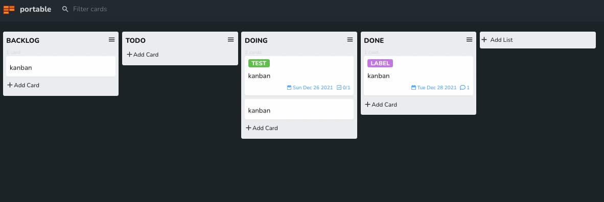

# Portable Kanban Extension for Visual Studio Code

A lightweight and portable kanban board extension for Visual Studio Code that allows you to create and manage kanban boards directly within your editor.




## Features

- ✅ Create and manage kanban boards within VS Code
- ✅ Drag and drop cards between lists
- ✅ Add descriptions, labels, and comments to cards
- ✅ Task lists with checkboxes
- ✅ Archive cards and lists
- ✅ Search and filter functionality
- ✅ Dark/Light theme support
- ✅ Portable .kanban file format

## Installation

### From VS Code Marketplace
1. Open VS Code
2. Go to Extensions (Ctrl+Shift+X)
3. Search for "Portable Kanban"
4. Click Install

### From Command Line
```bash
ext install portable-kanban
```

## Getting Started

### Creating a New Kanban Board

1. Open Command Palette (Ctrl+Shift+P / Cmd+Shift+P)
2. Type "Portable Kanban: Create new Kanban"
3. Choose a location and filename for your .kanban file
4. Your kanban board will open in a new editor tab

### Basic Usage

#### Adding Cards
- Click the "+" button in any list to add a new card
- **Bulk Add**: Hold Shift while typing to add multiple cards (one per line)
- **Add with Labels**: Use format `Label Name:Card Text` to add a card with a label

#### Managing Cards
- **Drag & Drop**: Move cards between lists by dragging
- **Edit**: Click on a card to edit its content, add descriptions, labels, or comments
- **Archive**: Use the menu to archive completed cards
- **Delete**: Remove unwanted cards from the board

#### Working with Lists
- Add new lists using the "Add List" button
- Rename lists by clicking on the list title
- Archive entire lists when no longer needed
- Move lists by dragging them

#### Filtering and Search
- Use the search bar to find specific cards
- Filter by labels to focus on specific types of work
- View archived cards and lists in separate views

## Configuration

Configure the extension through VS Code settings:

```json
{
  "portable-kanban.theme": "system", // "dark", "light", or "system"
  "portable-kanban.show-description": true, // Show/hide card descriptions
  "portable-kanban.show-task-list": true // Show/hide task lists in cards
}
```

## File Format

Kanban boards are stored as `.kanban` files in JSON format, making them:
- **Portable**: Easy to share and version control
- **Human-readable**: Can be edited manually if needed
- **Lightweight**: Small file size, efficient storage

## Keyboard Shortcuts

- `Ctrl+Shift+P` - Open Command Palette
- `Escape` - Close modals/dialogs
- `Enter` - Confirm edits
- `Shift+Enter` - Add multiple items

## Development

### Prerequisites
- Node.js 16+
- VS Code 1.92.0+

### Setup
```bash
git clone https://github.com/harehare/portable-kanban.git
cd portable-kanban
npm install
```

### Building
```bash
npm run build        # Production build
npm run watch        # Development build with watch
npm run package      # Package for publishing
```

### Testing
```bash
npm test            # Run tests
npm run lint        # Run linting
```

## Contributing

1. Fork the repository
2. Create a feature branch (`git checkout -b feature/amazing-feature`)
3. Commit your changes (`git commit -m 'Add amazing feature'`)
4. Push to the branch (`git push origin feature/amazing-feature`)
5. Open a Pull Request

## Roadmap

### Planned Features
- [ ] Sync with GitHub Projects
- [ ] Sync with Trello
- [ ] Related cards functionality
- [ ] Export to various formats (PDF, CSV)
- [ ] Custom card templates
- [ ] Time tracking
- [ ] Collaboration features

## License

This project is licensed under the MIT License - see the [LICENSE](LICENSE) file for details.

## Support

- 🐛 [Report bugs](https://github.com/harehare/portable-kanban/issues)
- 💡 [Request features](https://github.com/harehare/portable-kanban/issues)
- ⭐ [Star the project](https://github.com/harehare/portable-kanban) if you find it useful!
